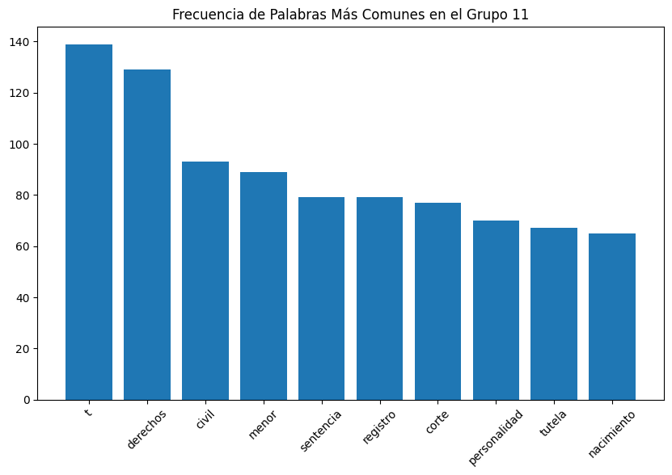
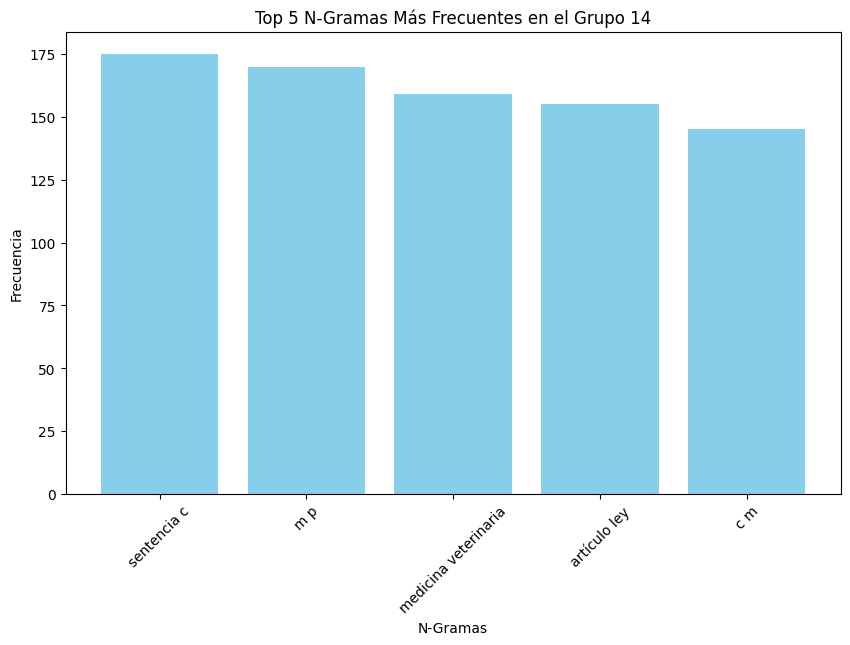
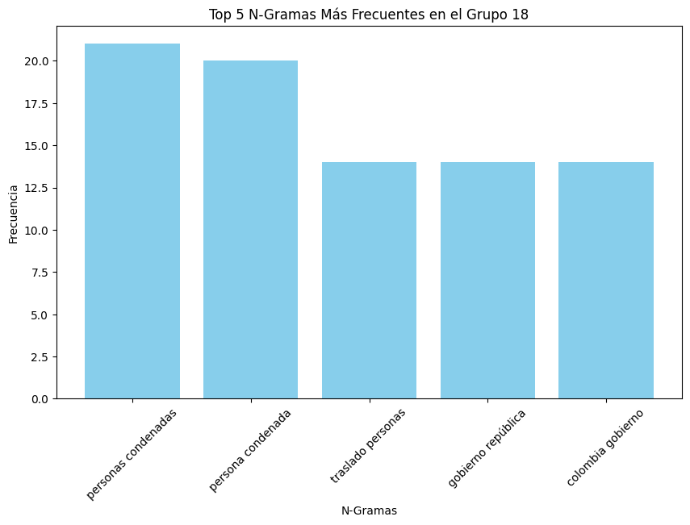

# Prueba JEP

### Autor: Andrés Rosso
### Email: andresrosso@gmail.com
### cc. 79.958.715

## Ejercicio de Recuperación Prueba JEP

El objetivo de este ejercicio es evaluar la capacidad de procesamiento de texto en el
ámbito de los derechos humanos utilizando la fuente de documentos públicos del
Tribunal Constitucional de Colombia. Se espera que los participantes implementen un
proceso de recuperación de información a partir de un conjunto de documentos.

Plazo de entrega:

Esta prueba se envía el día 8 de abril de 2024 a las 5pm y deberá ser devuelta el
jueves 5pm 11 de abril de 2024.


## Instrucciones:

La prueba debe ser desarrollada a través de scripts en el lenguaje de programación de
preferencia del participante, bajo el flujo de tareas que considere el participante. Debe
ser generado un documento metodológico donde se detalles los procesos realizados y
los resultados obtenidos. Queda a consideración del participante la forma de organizar
el desarrollo de la prueba. El resultado que se espera es un flujo de tareas, junto con
los scripts de código fuente en el que se desarrollan las mismas, donde se implemente
el proceso de recuperación de información con un documento metodológico. Si el
participante lo considera también se recibirá un repositorio con el desarrollo de la
prueba.

Los resultados deberán ser enviados a los correos electrónicos ya sea en archivo
comprimido o con acceso al repositorio donde se desarrolla la prueba.
harbey.rodriguez@jep.gov.co, juan.duenas@jep.gov.co, luis.moreno@jep.gov.co
Para la prueba se evaluará el procedimiento metodológico implementado, la
implementación del proceso en código fuente y la gestión del proceso.
Datos a usar:

El conjunto de datos a usar son los dispuestos en el siguiente enlace
https://www.kaggle.com/datasets/cristiancristancho/constitutional-court-of-colombia-
rapporteurships/data

Este es un corpus de reportes de la corte constitucional de Colombia llamado
&quot;Constitutional Court of Colombia Rapporteurships&quot;. Es posible realizar la prueba con
todos los documentos o una muestra representativa de los mismos, esto se deja a

criterio del participante. Sin embargo, debe ser claro qué conjunto de documentos fue
finalmente usado.

# Índice del Notebook

## Introducción

## 1. Preparación de Datos

Descripción: Carga de datos desde un archivo CSV que contiene ponencias legales, seguida de un preprocesamiento básico que incluye convertir el texto a minúsculas, eliminar puntuación y números, y la eliminación de palabras vacías.
Relevancia: El preprocesamiento es crucial para limpiar el texto y prepararlo para análisis más complejos, asegurando que los algoritmos de procesamiento de lenguaje natural trabajen con datos más limpios y estructurados.

## 2. Análisis Exploratorio de Texto

Descripción: Uso de bibliotecas de Python como NLTK y spaCy para realizar análisis exploratorio de texto, incluyendo la generación de n-gramas y la visualización de la frecuencia de palabras y bigramas.
Relevancia: Proporciona una comprensión inicial de los temas más comunes en los documentos y ayuda a identificar las palabras y frases clave que podrían ser importantes para análisis posteriores.

## 3. Análisis de Tópicos Latentes (LDA)

Descripción: Implementación de un modelo Latent Dirichlet Allocation para descubrir estructuras temáticas subyacentes en los documentos.
Relevancia: Ayuda a identificar los tópicos predominantes en un conjunto de textos legales, facilitando la comprensión y organización de los documentos de manera que resalte los temas jurídicos clave.

## 3. Extracción de Muestra Representativa Basada en LDA

Descripción: Selección de una muestra representativa de documentos basada en la distribución de temas aprendida durante el entrenamiento del modelo LDA.
Relevancia: Garantiza que la muestra refleje la diversidad de temas del conjunto completo, permitiendo análisis generalizables y confiables.

## 4. Análisis de Sentimientos

Descripción: Uso de TextBlob y análisis de NaiveBayes para evaluar la polaridad de los sentimientos en los documentos.
Relevancia: Importante para entender las connotaciones emocionales y las actitudes subyacentes en los textos legales, lo cual puede influir en la interpretación de las leyes y decisiones judiciales.

## 5. Reconocimiento de Entidades Nombradas (NER)

Descripción: Aplicación de spaCy para identificar y categorizar entidades nombradas en los textos, como personas, lugares y organizaciones.
Relevancia: Esencial para extraer información específica de los documentos, lo que facilita tareas como la indexación y búsqueda de información relevante en grandes volúmenes de texto legal.

## 6. Etiquetado de Partes del Discurso (POS Tagging)

Descripción: Uso de spaCy para etiquetar las partes del discurso en los documentos, como sustantivos, verbos y adjetivos.
Relevancia: Ayuda a entender la estructura gramatical de los textos y es útil para análisis lingüísticos más detallados y para mejorar los modelos de NLP.

## 7. Visualización de Datos

Descripción: Generación de nubes de palabras y gráficos de barras para visualizar la frecuencia de palabras y n-gramas.
Relevancia: Proporciona una representación visual intuitiva de los datos que puede ser fácilmente interpretada y utilizada para presentaciones o decisiones basadas en datos.

Este índice proporciona una visión clara de los pasos seguidos en el notebook y subraya la importancia de cada método en el contexto del análisis de documentos legales relacionados con los derechos humanos. 

## 8. Large Language Models (LLM)

Descripción: Discusión sobre los modelos de lenguaje de gran tamaño, su entrenamiento y capacidades.
Relevancia: Los LLM son fundamentales para comprender y generar lenguaje natural de manera eficaz. Su entrenamiento con grandes volúmenes de datos textuales les permite realizar tareas complejas de procesamiento de lenguaje que van más allá de los análisis básicos, como la generación de texto coherente y contextualmente adecuado.

### 8.1 Uso de LLM para Resumen Automático

Descripción: Implementación de un modelo T5, un tipo de LLM, para generar resúmenes automáticos de textos largos. El modelo T5 es utilizado específicamente por su capacidad de entender el contexto y producir resúmenes concisos y relevantes.
Relevancia: El resumen automático es especialmente útil en el ámbito legal, donde los documentos pueden ser extensos y complejos. Utilizar LLM para resumir textos permite a los profesionales y académicos obtener rápidamente la esencia de los documentos sin necesidad de revisarlos completamente, lo que ahorra tiempo y mejora la eficiencia en la gestión de información.

# Introducción Solución

Este análisis exploratorio se centra en las ponencias legales emitidas por el Tribunal Constitucional de Colombia, una entidad crucial en el panorama jurídico del país, encargada de velar por la integridad y supremacía de la Constitución. 

A través de un examen detallado de las sentencias y dictámenes emitidos por este tribunal, se busca identificar patrones, tendencias y el impacto de estas decisiones. 

Este estudio abarcará diversas áreas del derecho constitucional, incluyendo derechos humanos, equilibrio de poderes, y el papel del Tribunal en la dinámica política y social de Colombia, ofreciendo así una perspectiva amplia y detallada sobre el funcionamiento y las contribuciones de esta institución a la jurisprudencia y la democracia colombiana.

La metodología empleada combinará análisis cualitativos y cuantitativos, permitiendo una interpretación profunda de las ponencias legales y su correlación con los cambios legislativos y sociales a lo largo del tiempo. Al examinar el contenido, contexto y consecuencias de estas decisiones legales, este análisis busca proporcionar una visión integral de cómo el Tribunal Constitucional de Colombia cumple su misión de proteger la Constitución, influenciando directamente en la configuración de los derechos y deberes de los ciudadanos, así como en el desarrollo legal y constitucional del país.

# Análisis Exploratorio

Para comenzar el análisis exploratorio de texto (AET) detallado, utilizaré Python con bibliotecas populares como Pandas para manipulación de datos, Matplotlib y Seaborn para visualización, y NLTK y spaCy para procesamiento de lenguaje natural (PLN). La biblioteca Sklearn se utilizará para tareas de clustering. 


```python
import pandas as pd
import matplotlib.pyplot as plt
import seaborn as sns
from nltk import FreqDist, bigrams, trigrams, ngrams
from nltk.tokenize import word_tokenize
from nltk.corpus import stopwords
from sklearn.feature_extraction.text import CountVectorizer
from gensim.utils import simple_preprocess
import nltk
from wordcloud import WordCloud
from collections import Counter
import numpy as np

nltk.download('punkt')
nltk.download('stopwords')

idioma='spanish'
stop_words = set(stopwords.words(idioma))

# Cargar datos
def cargar_datos(ruta):
    """Carga el CSV que contiene las ponencias legales."""
    return pd.read_csv(ruta)

# Análisis exploratorio inicial
ruta_csv = 'data/DATA.csv'  # Cambia esto por la ruta real de tu archivo CSV
datos = cargar_datos(ruta_csv)
```

    [nltk_data] Downloading package punkt to /home/andresr/nltk_data...
    [nltk_data]   Package punkt is already up-to-date!
    [nltk_data] Downloading package stopwords to
    [nltk_data]     /home/andresr/nltk_data...
    [nltk_data]   Package stopwords is already up-to-date!


```python
# Preprocesamiento básico
def preprocesar_texto(texto):
    """Convierte el texto a minúsculas, elimina puntuación y números."""
    texto = texto.lower()
    texto = nltk.regexp_tokenize(texto, "[a-zA-ZáéíóúñÁÉÍÓÚÑ]+")
    return texto

# Eliminación de stop words
def eliminar_stopwords(tokens):
    """Elimina las stop words del texto tokenizado."""
    return [palabra for palabra in tokens if palabra not in stop_words]

# Generación de n-gramas
def generar_ngramas(tokens, n=2):
    """Genera n-gramas del texto tokenizado."""
    n_gramas = ngrams(tokens, n)
    return [" ".join(grama) for grama in n_gramas]

# Frecuencia de palabras
def frecuencia_palabras(tokens):
    """Calcula la frecuencia de cada palabra en el texto."""
    return FreqDist(tokens)

# Visualización de frecuencia de palabras
def graficar_frecuencias(frecuencias, titulo='Frecuencia de Palabras', n=20):
    """Grafica las n palabras más frecuentes."""
    frecuencias.plot(n, title=titulo)
```


```python
# Suponiendo que el texto de las ponencias está en la columna 'texto'
textos_procesados = datos['TEXT'].apply(preprocesar_texto)
textos_procesados = textos_procesados.apply(eliminar_stopwords)

# Calculando frecuencias para todos los documentos
frecuencias_totales = FreqDist()
for texto in textos_procesados:
    frecuencias_totales.update(texto)

# Graficando la frecuencia de palabras para todos los documentos
graficar_frecuencias(frecuencias_totales, 'Frecuencia de Palabras en Todos los Documentos')

# Generando bigramas para todos los documentos
bigramas_totales = []
for texto in textos_procesados:
    bigramas_totales.extend(generar_ngramas(texto, 2))

frecuencias_bigramas_totales = FreqDist(bigramas_totales)

# Graficando la frecuencia de bigramas para todos los documentos
graficar_frecuencias(frecuencias_bigramas_totales, 'Frecuencia de Bigramas en Todos los Documentos', 10)
```

    [nltk_data] Downloading package punkt to /home/andresr/nltk_data...
    [nltk_data]   Package punkt is already up-to-date!
    [nltk_data] Downloading package stopwords to
    [nltk_data]     /home/andresr/nltk_data...
    [nltk_data]   Package stopwords is already up-to-date!


    

    


    

    


Para las tareas más avanzadas, como el análisis de sentimientos, el reconocimiento de entidades nombradas, el speech tagging, y el clustering de documentos, necesitaré integrar y adaptar bibliotecas de NLP más avanzadas como spaCy, y para el análisis de sentimientos específicamente VADER, ajustándolas para el español.

Además, la visualización de nubes de palabras se hace utilizando la biblioteca WordCloud de Python, y el análisis de clustering puede requerir un enfoque más detallado utilizando algoritmos como K-Means o DBSCAN de la biblioteca sklearn.

# Analisis de Tópicos Latentes

El análisis de tópicos latentes en textos legales representa una poderosa herramienta de procesamiento de lenguaje natural (NLP) diseñada para descubrir las estructuras temáticas subyacentes dentro de grandes colecciones de documentos. Dado que los textos legales suelen ser extensos y complejos, con un lenguaje específico de la materia y una rica interconexión de conceptos, el análisis de tópicos latentes ayuda a destilar la esencia temática de los documentos, facilitando así su comprensión, organización y recuperación. Al aplicar técnicas como el Latent Dirichlet Allocation (LDA) entre otras, podemos desentrañar patrones y temas predominantes que no son inmediatamente aparentes, permitiendo una exploración más intuitiva del corpus legal.

Este enfoque no solo mejora significativamente la eficiencia en la gestión de documentos legales, sino que también abre nuevas avenidas para el análisis jurídico, la investigación y la toma de decisiones basada en datos. Al identificar los tópicos predominantes dentro de un conjunto de textos, los profesionales y académicos del derecho pueden obtener insights valiosos sobre tendencias legales, similitudes y diferencias entre jurisdicciones y la evolución de conceptos legales a lo largo del tiempo. En este notebook, nos adentraremos en los fundamentos del análisis de tópicos latentes aplicado a textos legales, explorando cómo esta técnica puede ser empleada para extraer conocimiento profundo y relevante de documentos complejos, mejorando así nuestra capacidad para navegar y analizar el vasto dominio del lenguaje legal.

## Extracción de Muestra Representativa Basada en LDA

Ya que el conjunto de datos es bastante grande (aproximadamente 36.000 documentos legales) se hace necesaria la extracción de una muestra representativa del mismo.

Esta muestra debe garantizar que los resultados obtenidos sean generalizables y aplicables a la población o conjunto de datos más amplio. Al seleccionar una muestra aleatoria que refleje adecuadamente las características de la población, se minimiza el sesgo y se aumenta la confiabilidad de los resultados. En el contexto específico de tomar una muestra de documentos para análisis, una muestra representativa asegura que los patrones y temas identificados en la muestra reflejen de manera precisa la distribución y la naturaleza de los documentos en el conjunto de datos completo. Utilizar el modelo LDA para tomar esta muestra es conveniente porque permite una selección basada en la distribución de temas aprendida durante el entrenamiento del modelo. Al asignar temas a cada documento y luego seleccionar aleatoriamente documentos en función de estas distribuciones de temas, se puede obtener una muestra que capture una variedad de temas de manera proporcional a su presencia en el conjunto de datos completo, lo que garantiza una representación adecuada de la diversidad temática presente en los documentos originales.

Ya que entrenar un modelo de tópicos latentes es costoso, es hace de manera offline en el notebook con el mismo nombre y se guarda el modelo en disco


```python
from gensim import models
from gensim.corpora import Dictionary
import os

# Load the model from disk
loaded_lda_model = models.LdaModel.load("lda_model")
```


```python
# Función de preprocesamiento básico
def preprocess_dict(text):
    result = []
    for token in simple_preprocess(text):
        if token not in stop_words:
            result.append(token)
    return result
```


```python
def crear_o_cargar_diccionario(ruta_diccionario='dictionary.gensim'):
    """
    Verifica si existe un archivo de diccionario en la ruta especificada y lo carga.
    Si no existe, crea un nuevo diccionario a partir de los documentos proporcionados y lo guarda en disco.
    """
    # Verifica si el archivo del diccionario existe
    if os.path.exists(ruta_diccionario):
        print("Cargando el diccionario existente...")
        diccionario = Dictionary.load(ruta_diccionario)
    else:
        print("Creando un nuevo diccionario...")
        # Tokeniza los documentos
        documentos_tokenizados = [simple_preprocess(doc) for doc in documentos]
        # Crea un diccionario
        diccionario = Dictionary(documentos_tokenizados)
        # Guarda el diccionario en disco
        diccionario.save(ruta_diccionario)
        print("Diccionario guardado en disco.")
    return diccionario

# Crear o cargar el diccionario
dictionary = crear_o_cargar_diccionario('dictionary.gensim')
```

    Cargando el diccionario existente...


```python
# Función para asignar temas a cada documento
def asignar_temas(documento):
    bow_vector = dictionary.doc2bow(documento)
    topics = loaded_lda_model.get_document_topics(bow_vector)
    return [topic[0] for topic in topics]  # Solo obtenemos los índices de los temas

# Aplicar la función a todos los documentos
temas_por_documento = processed_docs_dict.apply(asignar_temas)
```


```python
def crear_o_cargar_muestra(ruta_muestra='muestra_aleatoria_lda.csv'):
    """
    Verifica si existe un archivo de diccionario en la ruta especificada y lo carga.
    Si no existe, crea un nuevo diccionario a partir de los documentos proporcionados y lo guarda en disco.
    """
    # Verifica si el archivo del diccionario existe
    if os.path.exists(ruta_muestra):
        print("Cargando la muestra existente...")
        muestra_aleatoria = pd.read_csv(ruta_muestra)
    else:
        # Preprocesar cada documento
        processed_docs_dict = datos['TEXT'].map(preprocess_dict)
        print("Creando una nueva muestra...")
        # Aplicar la función a todos los documentos
        temas_por_documento = processed_docs_dict.apply(asignar_temas)
        # Seleccionar aleatoriamente 100 documentos
        indices_muestra = np.random.choice(len(datos), size=1000, replace=False)
        # Obtener la muestra aleatoria de documentos
        muestra_aleatoria = datos.iloc[indices_muestra]
        # Guardar la muestra aleatoria en un archivo CSV
        muestra_aleatoria.to_csv(ruta_muestra, index=False)
    return muestra_aleatoria

# Crear o cargar la muestra
muestra_aleatoria_lda = crear_o_cargar_muestra('muestra_aleatoria_lda.csv')
```

    Cargando la muestra existente...


## Análisis de Sentimientos

Para realizar un análisis de sentimientos, se puede usar la biblioteca TextBlob, que, aunque está principalmente orientada al inglés, puede ser adaptada para trabajar con español instalando un paquete adicional de datos de lenguaje.


```python
from textblob.sentiments import NaiveBayesAnalyzer
from textblob import TextBlob

# Análisis de sentimientos para todos los documentos
def analizar_sentimientos(texto):
    """Realiza análisis de sentimientos y devuelve la polaridad."""
    blob = TextBlob(texto, analyzer=NaiveBayesAnalyzer())
    return blob.sentiment
```

*Qué Representa la Expresión x.p_pos - x.p_neg:*

- Cuando p_pos es mayor que p_neg: La expresión resulta en un valor positivo, indicando que el texto es percibido como más positivo que negativo.
- Cuando p_pos es igual a p_neg: La expresión resulta en cero, sugiriendo un balance o neutralidad en la percepción del texto.
- Cuando p_pos es menor que p_neg: La expresión resulta en un valor negativo, indicando que el texto es percibido como más negativo que positivo.


```python
# Aplicando el análisis a todos los documentos
# muestra_aleatoria_lda['TEXT_PREPROCESADO'] = muestra_aleatoria_lda['TEXT'].apply(preprocesar_texto).apply(lambda x: ' '.join(x))
sentimientos = muestra_aleatoria_lda['TEXT_PREPROCESADO'].apply(analizar_sentimientos)

# Agregar resultados del análisis de sentimientos al DataFrame
datos['Polaridad'] = sentimientos.apply(lambda x: x.p_pos - x.p_neg)

# Visualización de la distribución de la polaridad
sns.histplot(datos['Polaridad'])
plt.title('Distribución de la Polaridad del Sentimiento')
plt.xlabel('Polaridad')
plt.ylabel('Frecuencia')
plt.show()
```

El hecho que la polaridad este cerca a uno indica que los documentos tienen polaridad positiva en su mayoría.


```python
plt.show()
```

    

    


## Reconocimiento de Entidades Nombradas (NER)

Para el reconocimiento de entidades nombradas y su categoría, se puede utilizar la biblioteca spaCy. Primero, se tener une debe tener modelo en español.


```python
nlp.max_length = 2000000
```


```python
import spacy
import pandas as pd
import matplotlib.pyplot as plt

#textos = muestra_aleatoria_lda['TEXT'][0:5000]
textos = muestra_aleatoria_lda['TEXT'].sample(n=100, random_state=42)
# Carga el modelo en español
nlp = spacy.load('es_core_news_sm')

def reconocer_entidades(texto):
    """Identifica entidades nombradas en el texto y devuelve una lista de entidades y categorías."""
    # Esto ya que si contiene mas caracteres falla spacy
    if len(texto) > 1000000:
        texto = texto[:1000000]
    doc = nlp(texto)
    return [(ent.text, ent.label_) for ent in doc.ents]

# Lista para almacenar todas las entidades nombradas y sus categorías
entidades_total = []

# Iterar sobre todos los documentos y aplicar NER
for texto in textos:
    entidades_doc = reconocer_entidades(texto)
    entidades_total.extend(entidades_doc)

# Convertir la lista de entidades a un DataFrame
entidades_df = pd.DataFrame(entidades_total, columns=['Entidad', 'Categoría'])
```


```python
# Calcular la frecuencia de entidades individuales
entidades_frecuencia_entidad = entidades_df['Entidad'].value_counts().nlargest(10)  # Top 10 entidades más frecuentes

# Visualizar la frecuencia de las entidades más comunes
plt.figure(figsize=(10, 5))
entidades_frecuencia_entidad.plot(kind='bar', color='green')
plt.title('Top 10 Entidades Nombradas Más Frecuentes')
plt.xlabel('Entidad')
plt.ylabel('Frecuencia')
plt.xticks(rotation=45)
plt.show()
```


    

    


```python
# Calcular la frecuencia de categorías de entidades
entidades_frecuencia = entidades_df['Categoría'].value_counts()

# Visualizar la frecuencia de categorías de entidades
entidades_frecuencia.plot(kind='bar')
plt.title('Frecuencia de Categorías de Entidades Nombradas')
plt.xlabel('Categoría')
plt.ylabel('Frecuencia')
plt.xticks(rotation=45)
plt.show()
```


    

    


## Etiquetado de Partes del Discurso (POS Tagging)

El etiquetado de partes del discurso se puede realizar también con spaCy. Aquí se muestra cómo etiquetar y visualizar la frecuencia de las etiquetas POS:


```python
# Etiquetar partes del discurso (POS tagging) para todos los documentos
def etiquetar_pos(texto):
    """Etiqueta las partes del discurso del texto y devuelve una lista de etiquetas."""
    if len(texto) > 1000000:
        texto = texto[:1000000]
    doc = nlp(texto)
    return [token.pos_ for token in doc]

# Aplicar POS tagging a todos los documentos
pos_tags_total = []
for texto in muestra_aleatoria_lda['TEXT']:
    pos_tags_total.extend(etiquetar_pos(texto))

# Calcular la frecuencia de etiquetas POS
pos_frecuencia_total = pd.Series(pos_tags_total).value_counts()

# Visualización de la frecuencia de POS tags
pos_frecuencia_total.plot(kind='bar')
plt.title('Frecuencia de Etiquetas POS en Todos los Documentos')
plt.xlabel('Etiqueta POS')
plt.ylabel('Frecuencia')
plt.xticks(rotation=45)
```


    (array([ 0,  1,  2,  3,  4,  5,  6,  7,  8,  9, 10, 11, 12, 13, 14, 15, 16]),
     [Text(0, 0, 'NOUN'),
      Text(1, 0, 'ADP'),
      Text(2, 0, 'DET'),
      Text(3, 0, 'PUNCT'),
      Text(4, 0, 'ADJ'),
      Text(5, 0, 'PROPN'),
      Text(6, 0, 'VERB'),
      Text(7, 0, 'PRON'),
      Text(8, 0, 'CCONJ'),
      Text(9, 0, 'NUM'),
      Text(10, 0, 'SPACE'),
      Text(11, 0, 'SCONJ'),
      Text(12, 0, 'ADV'),
      Text(13, 0, 'AUX'),
      Text(14, 0, 'SYM'),
      Text(15, 0, 'PART'),
      Text(16, 0, 'INTJ')])


    

    


## Nube de Palabras por Tópico

Para crear una nube de palabras con todos los tópicos, necesitas extraer las palabras más representativas de cada tópico y combinarlas en una lista única. Luego, puedes generar una visualización de nube de palabras a partir de esta lista combinada. Aquí te mostramos cómo hacerlo:

Iteramos sobre cada tópico para extraer las palabras clave usando el método show_topics() y las unimos en una lista común. Después, generamos la nube de palabras utilizando el módulo WordCloud de la biblioteca wordcloud. Finalmente, mostramos la nube de palabras con matplotlib. Esta visualización te ofrecerá una representación gráfica general de las palabras más frecuentes en todos los tópicos, facilitando la interpretación de los temas o conceptos predominantes en tu colección de documentos. 


```python
from wordcloud import WordCloud
import matplotlib.pyplot as plt

# Puede cambiar este valor para mostrar las nubes de palabras para mas topicos
NUM_TOPICS = 10

# Obtener los 5 primeros tópicos y sus palabras más relevantes
topics = loaded_lda_model.show_topics(num_topics=10, num_words=20, formatted=False)

# Generar y mostrar una nube de palabras para cada uno de los 5 tópicos
for i, topic in enumerate(topics, start=1):
    # Extraer las palabras más relevantes del tópico actual
    topic_words = [word for word, _ in topic[1]]
    
    # Combinar las palabras más relevantes en una sola cadena
    topic_words_str = ' '.join(topic_words)
    
    # Generar nube de palabras para el tópico actual
    wordcloud = WordCloud(width=400, height=200, background_color='white').generate(topic_words_str)
    
    # Mostrar la nube de palabras
    plt.figure(figsize=(5, 2.5))
    plt.imshow(wordcloud, interpolation='bilinear')
    plt.title(f'Nube de Palabras para el Tópico {i}')
    plt.axis('off')

plt.show()

```


    

    


    

    


    

    


    

    


    

    


    

    


    

    


    

    


    

    


    

    


## Agrupación de Documentos por Tópico

Agrupar Documentos por Tópico: El objetivo es agrupar los documentos basándose en sus tópicos asignados.

El proceso para lograrlo es el siguiente:

* Paso 1: Entrena el modelo LDA con tu corpus de documentos. 
* Paso 2: Agrupa los documentos por sus tópicos asignados basándote en el modelo LDA. 
* Paso 3: Para cada grupo de documentos, extrae las palabras más frecuentes. 
* Paso 4: Para cada grupo de documentos, encuentra los pares de palabras consecutivas más frecuentes (bigramas). 

**Puedes ajustar parámetros como el número de tópicos (num_topics), el número de palabras más frecuentes a mostrar y el número de n-gramas más frecuentes a mostrar según tus necesidades específicas.


```python
from gensim import corpora, models
from collections import Counter
import matplotlib.pyplot as plt

# Crear el corpus (BoW) de los textos
texts = muestra_aleatoria_lda['TEXT_PREPROCESADO'].apply(preprocesar_texto).apply(eliminar_stopwords).tolist()
corpus = [dictionary.doc2bow(text) for text in texts]

# Paso 2: Agrupar documentos por tópico
document_topics = [max(loaded_lda_model[doc], key=lambda x: x[1])[0] for doc in corpus]
grouped_documents = {topic: [] for topic in range(loaded_lda_model.num_topics)}
for doc_id, topic in enumerate(document_topics):
    grouped_documents[topic].append(doc_id)

# Paso 3: Extraer las palabras más frecuentes para cada grupo
for topic, documents in grouped_documents.items():
    try:
        print(f"Grupo {topic}:")
        group_texts = [texts[doc_id] for doc_id in documents]
        all_words = [word for text in group_texts for word in text]
        word_freq = Counter(all_words)
        most_common_words = word_freq.most_common(10)  # Obtener las 10 palabras más frecuentes
        print("Palabras más frecuentes:", most_common_words)

        # Graficar la frecuencia de las palabras más comunes
        words, frequencies = zip(*most_common_words)
        plt.figure(figsize=(10, 6))
        plt.bar(words, frequencies)
        plt.title(f"Frecuencia de Palabras Más Comunes en el Grupo {topic}")
        plt.xticks(rotation=45)
        plt.show()
    except:
        print('Algunos grupos pueden no tener documentos')
```

    Grupo 0:
    Palabras más frecuentes: [('tutela', 149), ('t', 123), ('constitucional', 122), ('corte', 96), ('sentencia', 92), ('sala', 78), ('juez', 78), ('acción', 75), ('derecho', 64), ('derechos', 63)]


    

    


    Grupo 1:
    Palabras más frecuentes: [('cuaderno', 42), ('familia', 37), ('tutela', 36), ('ver', 36), ('cabeza', 34), ('accionante', 32), ('ley', 27), ('palmira', 26), ('protección', 25), ('folios', 24)]


    

    


    Grupo 2:
    Palabras más frecuentes: [('derechos', 143), ('imagen', 118), ('derecho', 107), ('consentimiento', 96), ('persona', 95), ('sentencia', 93), ('tutela', 92), ('t', 91), ('video', 86), ('constitucional', 84)]


    

    


    Grupo 3:
    Palabras más frecuentes: []
    Algunos grupos pueden no tener documentos
    Grupo 4:
    Palabras más frecuentes: [('artículo', 1711), ('partidos', 1553), ('ley', 1492), ('movimientos', 1419), ('electoral', 1263), ('políticos', 1104), ('constitucional', 904), ('c', 864), ('corte', 835), ('financiación', 816)]


    

    


    Grupo 5:
    Palabras más frecuentes: [('proceso', 222), ('derecho', 172), ('sala', 140), ('derechos', 137), ('sentencia', 135), ('parte', 134), ('tutela', 132), ('civil', 128), ('corte', 126), ('obligación', 125)]


    

    


    Grupo 6:
    Palabras más frecuentes: [('penal', 226), ('extradición', 162), ('derecho', 125), ('artículo', 125), ('corte', 119), ('si', 99), ('ley', 97), ('proceso', 94), ('defensa', 82), ('fiscalía', 82)]


    

    


    Grupo 7:
    Palabras más frecuentes: [('tutela', 279), ('acción', 210), ('derecho', 209), ('derechos', 185), ('constitucional', 142), ('artículo', 128), ('corte', 113), ('protección', 101), ('judicial', 94), ('sala', 93)]


    

    


    Grupo 8:
    Palabras más frecuentes: [('servicios', 91), ('t', 89), ('contrato', 89), ('prestación', 86), ('licencia', 73), ('pago', 61), ('maternidad', 59), ('pues', 56), ('si', 51), ('contratos', 49)]


    

    


    Grupo 9:
    Palabras más frecuentes: [('patrimonio', 472), ('cultural', 406), ('bienes', 233), ('ley', 226), ('sumergido', 177), ('artículo', 171), ('protección', 160), ('nación', 151), ('parte', 89), ('c', 80)]


    

    


    Grupo 10:
    Palabras más frecuentes: [('tutela', 327), ('competencia', 265), ('sala', 189), ('constitucional', 181), ('corte', 179), ('acción', 176), ('decreto', 140), ('superior', 139), ('auto', 135), ('artículo', 134)]


    

    


    Grupo 11:
    Palabras más frecuentes: [('t', 139), ('derechos', 129), ('civil', 93), ('menor', 89), ('sentencia', 79), ('registro', 79), ('corte', 77), ('personalidad', 70), ('tutela', 67), ('nacimiento', 65)]


    

    


    Grupo 12:
    Palabras más frecuentes: [('protección', 270), ('justicia', 226), ('víctimas', 222), ('derechos', 200), ('paz', 156), ('programa', 151), ('riesgo', 148), ('ley', 127), ('testigos', 117), ('mujeres', 113)]


    

    


    Grupo 13:
    Palabras más frecuentes: [('sentencia', 217), ('sala', 204), ('t', 178), ('corte', 169), ('tutela', 161), ('constitucional', 143), ('proceso', 111), ('derecho', 103), ('nulidad', 101), ('acción', 100)]


    

    


    Grupo 14:
    Palabras más frecuentes: [('artículo', 594), ('ley', 559), ('c', 429), ('corte', 391), ('derecho', 272), ('constitucional', 260), ('sentencia', 243), ('norma', 227), ('demanda', 222), ('ser', 220)]


    

    


    Grupo 15:
    Palabras más frecuentes: [('p', 125), ('m', 123), ('sala', 41), ('tutela', 39), ('auto', 37), ('magistrado', 33), ('decisión', 32), ('corte', 30), ('constitucional', 27), ('sentencia', 27)]


    

    


    Grupo 16:
    Palabras más frecuentes: [('artículo', 210), ('bienes', 158), ('ley', 154), ('corte', 138), ('c', 135), ('general', 127), ('tarifa', 104), ('tributario', 103), ('legislador', 101), ('constitucional', 97)]


    

    


    Grupo 17:
    Palabras más frecuentes: [('salud', 765), ('t', 408), ('derecho', 404), ('tutela', 288), ('derechos', 253), ('social', 229), ('sentencia', 210), ('constitucional', 202), ('médico', 195), ('tratamiento', 193)]


    

    


    Grupo 18:
    Palabras más frecuentes: [('tratado', 92), ('traslado', 49), ('persona', 36), ('artículo', 36), ('receptor', 36), ('colombia', 32), ('derecho', 31), ('corte', 30), ('gobierno', 30), ('personas', 29)]


    

    


    Grupo 19:
    Palabras más frecuentes: [('derecho', 573), ('ley', 540), ('pensión', 510), ('t', 485), ('social', 453), ('artículo', 387), ('tutela', 362), ('sentencia', 351), ('régimen', 341), ('seguridad', 312)]


    

    


```python
# Paso 4: Encontrar el grupo de palabras más frecuentes (n-gramas) para cada grupo y graficar
for topic, documents in grouped_documents.items():
    print(f"Grupo {topic}:")
    group_texts = [texts[doc_id] for doc_id in documents]
    all_ngrams = [word for text in group_texts for word in text]  # Aplanar lista de listas
    
    # Crear n-gramas y contar su frecuencia
    ngram_freq = Counter(zip(all_ngrams[:-1], all_ngrams[1:]))  # Contar pares de palabras consecutivas
    most_common_ngrams = ngram_freq.most_common(5)  # Obtener los 5 pares de palabras más frecuentes

    # Preparar datos para el gráfico
    ngram_labels = [' '.join(ngram) for ngram, _ in most_common_ngrams]
    frequencies = [freq for _, freq in most_common_ngrams]

    # Crear el gráfico de barras
    plt.figure(figsize=(10, 6))
    plt.bar(ngram_labels, frequencies, color='skyblue')
    plt.title(f'Top 5 N-Gramas Más Frecuentes en el Grupo {topic}')
    plt.xlabel('N-Gramas')
    plt.ylabel('Frecuencia')
    plt.xticks(rotation=45)
    plt.show()
```

    Grupo 0:


    

    


    Grupo 1:


    

    


    Grupo 2:


    

    


    Grupo 3:


    

    


    Grupo 4:


    

    


    Grupo 5:


    

    


    Grupo 6:


    

    


    Grupo 7:


    

    


    Grupo 8:


    

    


    Grupo 9:


    

    


    Grupo 10:


    

    


    Grupo 11:


    

    


    Grupo 12:


    

    


    Grupo 13:


    

    


    Grupo 14:


    

    


    Grupo 15:


    

    


    Grupo 16:


    

    


    Grupo 17:


    

    


    Grupo 18:


    

    


    Grupo 19:


    

    


# Large Language Models


Un modelo de lenguaje de gran tamaño (LLM por sus siglas en inglés) es una clase de tecnología de inteligencia artificial diseñada para entender y generar lenguaje humano de manera natural y fluida. Estos modelos se entrenan con vastas cantidades de texto, lo que les permite aprender desde la estructura gramatical hasta las complejidades del lenguaje, incluyendo juegos de palabras y matices contextuales. Al ser expuestos a una gran diversidad de temas y estilos de escritura, los LLM aprenden a predecir y generar texto de manera coherente y relevante a partir de los ejemplos que han visto durante su entrenamiento.

Gracias a su amplia capacitación, los LLM son extremadamente versátiles y pueden realizar una variedad de tareas relacionadas con el lenguaje. Entre estas tareas se incluyen la traducción automática de un idioma a otro, el resumen de textos largos, la generación de contenido creativo como poemas o historias, y la creación de respuestas en sistemas de chatbot. Además, pueden ayudar en la comprensión de documentos legales y técnicos, facilitando tareas como la búsqueda de información relevante y la automatización de respuestas a preguntas frecuentes. Estas habilidades los hacen herramientas valiosas tanto en el ámbito académico como en una amplia gama de industrias.


```python
import importlib
import transformers

importlib.reload(transformers)
```


    <module 'transformers' from '/home/andresr/.conda/envs/pytorch2.2/lib/python3.10/site-packages/transformers/__init__.py'>


## Resumen de Textos


```python
from transformers import T5Tokenizer, T5ForConditionalGeneration

# Cargar el modelo y el tokenizador de T5 específicamente entrenado para resumir
model_name = 't5-large'  # Puedes cambiar a 't5-base' o 't5-large' para una mayor precisión
tokenizer = T5Tokenizer.from_pretrained(model_name)
model = T5ForConditionalGeneration.from_pretrained(model_name)

def summarize_text(text, max_length=150):
    """
    Función para resumir un texto largo utilizando el modelo T5.
    Args:
    - text (str): Texto largo que se desea resumir.
    - max_length (int): Longitud máxima del resumen en tokens.

    Returns:
    - str: Texto resumido.
    """
    # Preprocesar el texto de entrada para el formato que T5 espera
    preprocess_text = text.strip().replace("\n","")
    t5_prepared_text = "summarize: " + preprocess_text

    # Codificar el texto para que sea compatible con el modelo
    tokenized_text = tokenizer.encode(t5_prepared_text, return_tensors="pt", max_length=512, truncation=True)

    # Generar el resumen
    summary_ids = model.generate(tokenized_text,
                                 num_beams=4,
                                 no_repeat_ngram_size=2,
                                 min_length=300,
                                 max_length=max_length,
                                 early_stopping=True)

    # Decodificar los tokens a string
    output = tokenizer.decode(summary_ids[0], skip_special_tokens=True)

    return output
```

    Special tokens have been added in the vocabulary, make sure the associated word embeddings are fine-tuned or trained.


```python
# Ejemplo de uso
text = datos.iloc[4]['TEXT']
summary = summarize_text(text)
print("Texto Completo:  \n\n")
print(text, "\n")
print("-------------------\n")
print("-------------------\n")
print("Resumen generado: \n", summary)
print("-------------------\n")
print("-------------------\n")
```

    Texto Completo:  
    
    
    Auto 001/04
    
    CONFLICTO DE COMPETENCIA EN TUTELA-Superior jerárquico común
    
    CONFLICTO DE COMPETENCIA EN TUTELA-Asunción por Corte Constitucional cuando no existe superior jerárquico común
    
    CONFLICTO DE COMPETENCIA EN TUTELA-Aplicación de normas generales
    
    COMPETENCIA A PREVENCION EN TUTELA-Aplicación
    
    CORTE CONSTITUCIONAL-Competencia residual/CONFLICTO DE COMPETENCIA/PRINCIPIOS DE CELERIDAD Y SUMARIEDAD
    
    A pesar de que la Corte ha reconocido reiteradamente que su competencia es residual y que cuando los jueces en conflicto tengan un superior jerárquico común que pueda conocer del conflicto no le corresponde a esta Corporación hacerlo, en virtud de los principios de celeridad y sumariedad en el procedimiento de tutela, y del derecho al acceso oportuno a la administración de justicia, la Corte ha llegado a asumir de manera directa el conocimiento de conflictos de competencia teniendo en cuenta el objetivo de garantizar la mejor protección de los derechos fundamentales.(...) la resolución de los conflictos de competencia debe atender dos principios básicos que orientan la protección de los derechos fundamentales... Estos principios son, en primer lugar, la eficacia de los derechos fundamentales (art. 2 C.P.), para lo cual es necesario -las más de las veces- atender al postulado de prevalencia del derecho substancial sobre el procedimental; y en segundo lugar, la sumariedad, celeridad e informalidad del procedimiento de tutela (art. 86 C.P.), entendidos como condición necesaria para la protección real y oportuna de este tipo especial de derechos constitucionales. 
    
    
    Referencia: expediente ICC-764
    
    Conflicto de Competencia entre el Consejo Seccional de la Judicatura de Cundinamarca, Sala Disciplinaria, y el Consejo Seccional de la Judicatura del Atlántico, Sala Disciplinaria
    
    Magistrado Ponente:
    Dr. MARCO GERARDO MONROY CABRA
    
    
    
    Bogotá, D. C., veinte (20) de enero  de dos mil cuatro (2004).
    
    La Sala Plena de la Corte Constitucional, en cumplimiento de sus atribuciones constitucionales y de los requisitos y trámites establecidos en el Decreto 2067 de 1991, profiere el siguiente 
    
    
    AUTO
    
    
    ANTECEDENTES
    
    1.	El 20 de octubre de 2003, el señor Jhon Jairo Díaz Arias, residente en Barranquilla, interpuso acción de tutela en Barranquilla ante el Consejo Superior de la Judicatura, contra la Dirección Nacional de Estupefacientes, con sede en Bogotá, por considerar vulnerados su derechos al trabajo y a la vida digna, toda vez que no ha recibido el certificado de carencia de informe de tráfico de estupefacientes, el cual requiere para obtener la licencia de navegación, siendo su profesión la de navegante.
    2.	El Consejo Seccional de la Judicatura del Atlántico, Sala Disciplinaria, mediante auto del 20 de octubre de 2003 consideró que por ser la sede de la entidad demandada Bogotá y, por tanto, estar ocurriendo ahí la vulneración, la competencia la tenía el Consejo Seccional de la Judicatura de Cundinamarca.
    3.	Mediante providencia del 28 de octubre de 2003, el Consejo Seccional de la Judicatura de Cundinamarca, Sala Disciplinaria, consideró que el lugar de la presunta vulneración del derecho fundamental se daba en el domicilio del accionante, y, por tanto, el competente era el Consejo Seccional de la Judicatura del Atlántico.
    4.	El Consejo Seccional de la Judicatura del Atlántico, Sala Disciplinaria, mediante auto del 5 de noviembre de 2003 reiteró su incompetencia en virtud de que el artículo 1º, inciso 1º, del Decreto 1382 de 2000 indica que la competencia a prevención la tienen los jueces con jurisdicción donde ocurriere la violación o la amenaza que motivare la presentación de la solicitud o donde se produjeren sus efectos. Así las cosas la competencia del juez en el lugar donde se producen los efectos se presenta como una tercera posibilidad, siendo principal el lugar donde ocurre la violación. En este caso, la sede de la entidad accionada, es decir, Bogotá. Por tal motivo, envió el expediente a la Corte Constitucional, para que resolviera el conflicto.
    
    
    CONSIDERACIONES
    
    1. En pronunciamientos anteriores, esta Corporación estableció que no está dentro de sus atribuciones resolver conflictos de competencia entre jueces de la misma jurisdicción que cuenten con un superior jerárquico común.1
    
    Si bien no existe norma que lo disponga de manera expresa, los conflictos que se susciten en materia de tutela, deben ser resueltos por el superior jerárquico común de los jueces o tribunales entre los cuales se presente la colisión. Sólo en caso de no existir superior jerárquico común, la Corte Constitucional tiene la competencia para conocer de tal diferencia.2
    
    2. En el presente conflicto de competencia el superior jerárquico común del Consejo Seccional de la Judicatura de Cundinamarca, Sala Disciplinaria, y el Consejo Seccional de la Judicatura del Atlántico, Sala Disciplinaria, es el Consejo Superior de la Judicatura, Sala Disciplinaria. Es éste quien en principio debería conocer del presente conflicto3.
    
    3. A pesar de que la Corte ha reconocido reiteradamente que su competencia es residual y que cuando los jueces en conflicto tengan un superior jerárquico común que pueda conocer del conflicto no le corresponde a esta Corporación hacerlo, en virtud de los principios de celeridad y sumariedad en el procedimiento de tutela, y del derecho al acceso oportuno a la administración de justicia, la Corte ha llegado a asumir de manera directa el conocimiento de conflictos de competencia teniendo en cuenta el objetivo de garantizar la mejor protección de los derechos fundamentales. Ha dicho la Corporación:
    
    "No puede olvidar esta Corte, y este ha sido su criterio, que la resolución de los conflictos de competencia debe atender dos principios básicos que orientan la protección de los derechos fundamentales, como objetivo primordial de la Constitución de 1991 y de la consagración de la acción de tutela. Estos principios son, en primer lugar, la eficacia de los derechos fundamentales (art. 2 C.P.), para lo cual es necesario -las más de las veces- atender al postulado de prevalencia del derecho substancial sobre el procedimental; y en segundo lugar, la sumariedad, celeridad e informalidad del procedimiento de tutela (art. 86 C.P.), entendidos como condición necesaria para la protección real y oportuna de este tipo especial de derechos constitucionales. 
    
    La Corte no puede ser permisiva con la dilación de los términos ni con la renuencia de las autoridades a asumir de manera definitiva el conocimiento de las solicitudes de tutela. En este sentido, la Sala considera que remitir a la Corte Suprema las presentes diligencias para que ella resuelva el conflicto de competencia, agravaría aun más la situación de la peticionaria, quien por demás, no tiene por que sufrir la mora que aparejan los problemas de interpretación de las normas de competencia para conocer de la acción de tutela."4
    
    4. Dado el tiempo transcurrido desde la interposición de la tutela hasta la fecha en que esta Corporación conoce del conflicto de competencia, la Sala considera necesario entrar a resolver de manera directa la presente colisión.
    
    (i) Corresponde a los Tribunales Superiores de Distrito Judicial, Administrativos y Consejos Seccionales conocer de las acciones de tutela interpuestas contra entidades de carácter nacional, según lo dispuesto en el artículo 1º numeral 1º del Decreto 1382 de 2000. En esa medida, en principio, tanto Consejo Seccional de la Judicatura del Atlántico, Sala Disciplinaria, como el Consejo Seccional de la Judicatura de Cundinamarca, Sala Disciplinaria, tendrían competencia, en virtud de la naturaleza de la Dirección Nacional de Estupefacientes. Para determinar a qué juez corresponde el conocimiento definitivo de la tutela se entrará a estudiar el factor territorial.
    
    (ii) La Sala observa que el lugar de la vulneración del derecho fundamental no es Bogotá, así la sede de la demandada se encuentre ahí5, sino Barranquilla, puesto que allí se encuentra residiendo y aduce trabajar el accionante. En esa medida, es ahí donde su derecho al trabajo se ve presuntamente vulnerado por la no expedición del certificado requerido para navegar.
    
    Teniendo en cuenta que un factor determinante de la competencia en materia de tutela es el territorial, según el artículo 37 del Decreto 2591 de 19916 y el artículo 1º del Decreto 13827, se enviará la tutela Consejo Seccional de la Judicatura del Atlántico, Sala Disciplinaria. 
    
    
    DECISIÓN
    
    Con base en las anteriores consideraciones, la Sala Plena de la Corte Constitucional, en ejercicio de sus atribuciones constitucionales y legales, 
    
    
    RESUELVE:
    
    PRIMERO: REMITIR el expediente de tutela al Consejo Seccional de la Judicatura del Atlántico, Sala Disciplinaria, para que adelante la correspondiente actuación judicial.
    
    
    
    
    CLARA INES VARGAS HERNANDEZ
    Presidente
    
    
    
    
    JAIME ARAUJO RENTERIA
    Magistrado
    
    
    
    
    ALFREDO BELTRAN SIERRA
    Magistrado
    
    
    
    
    MANUEL JOSE CEPEDA ESPINOSA
    Magistrado
    
    
    
    
    JAIME CORDOBA TRIVIÑO
    Magistrado
    
    
    
    
    RODRIGO ESCOBAR GIL
    Magistrado
    
    
    
    
    MARCO GERARDO MONROY CABRA
    Magistrado
    
    
    
    
    EDUARDO MONTEALEGRE LYNETT
    Magistrado
    
    
    
    
    ALVARO TAFUR GALVIS
    Magistrado
    
    
    
    
    IVAN HUMBERTO ESCRUCERIA MAYOLO
    Secretario General (e)
    
    Salvamento de voto al Auto 001/04
    
    
    Referencia: expediente ICC-764
    
    Peticionario: Jhon Jairo Díaz Arias
    
    
    
    Tal como lo señalé en el salvamento de voto que presenté en el proceso ICC-226, considero que la Corte Constitucional no tiene facultad expresa para pronunciarse sobre los conflictos de competencia que se presenten entre las distintas autoridades judiciales en materia de tutela, por las razones que allí expuse ampliamente, las cuales son igualmente aplicables a este caso y a ellas me remito.
    
    
    Fecha ut supra,
    
    
    
    
    JAIME ARAUJO RENTERÍA
    Magistrado
    1 Ver auto A-044/98,  M.P. José Gregorio Hernández Galindo (En esta ocasión la Corte  se abstuvo de dirimir un conflicto de competencia entre el Juzgados 25 Civil del Circuito de Bogotá y 5 Civil del Circuito de  Neiva y remitió el conflicto a la Corte Suprema de Justicia, Sala de Casación Civil para su solución)
    2 Ver auto del 14 de marzo de 2001 ICC-147 Magistrado ponente Marco Gerardo Monroy Cabra
    3 Tal afirmación se complementa y soporta con el artículo 112 de la Ley Estatutaria de Administración de Justicia que contempla:
    "FUNCIONES DE LA SALA JURISDICCIONAL DISCIPLINARIA DEL CONSEJO SUPERIOR DE LA JUDICATURA. Corresponde a la Sala Jurisdiccional Disciplinaria del Consejo Superior de la Judicatura: (...) 2.Dirimir los conflictos de competencia que ocurran entre las distintas jurisdicciones, y entre éstas y las autoridades administrativas a las cuales le ley les haya atribuido funciones jurisdiccionales, salvo los que se prevén en el artículo 114, numeral tercero, de esta Ley y entre los Consejos Seccionales o entre dos salas de un mismo Consejo Seccional (...)""(subrayas ajenas al texto)
    
    4 Ver ICC-720 del 30 de septiembre de 2003, M.P. Eduardo Montealegre Lynett, en el cual esta Corporación conoció de manera directa un conflicto de competencia entre las salas Civil-Familia y Penal del Tribunal Superior de Buga, a pesar de que la Corte Suprema de Justicia era la entidad que, en principio, debía resolverlo, toda vez que habían transcurrido más de tres meses desde la interposición de la tutela sin que esta pudiera haber sido resuelta en virtud de la colisión. Ver también  ICC-711, M.P. Eduardo Montealegre Lynett, en el cual la Corte asumió conocimiento del conflicto entre el Juzgado 26 Penal del Circuito de Bogotá y el Tribunal Superior de Bogotá -Sala Penal- a pesar de que, en virtud de la competencia residual de esta Corporación debería conocer la Corte Suprema de Justicia. Para el momento de la resolución del conflicto de competencia ya habían transcurrido más de 6 meses desde la interposición de la tutela.
    5 En este sentido ver sentencias T-063/01, M.P. Alfredo Beltrán Sierra, T-883/00, M.P. Vladimiro Naranjo Mesa y auto A-051/03, M.P. Clara Inés Vargas
    6 Artículo 37. Primera instancia. Son competentes para conocer de la acción de tutela, a prevención, los jueces o tribunales con jurisdicción en el lugar donde ocurriere la violación o la amenaza que motivaren la presentación de la solicitud.
    7 "conocerán de la acción de tutela, a prevención, los jueces con jurisdicción donde ocurriere la violación o la amenaza que motivare la presentación de la solicitud o donde se produjeren sus efectos (...)"
    
    
    
    
    
    
    
    
    
    
     
    
    -------------------
    
    -------------------
    
    Resumen generado: 
     conflicto de competencia en tutela -asunción por corte constitucional cuando no existe superior jerárquico comnCONFLICTO DE COMPETENCIA EN TUTELA-Aplicación de nmeros generalesCompetencia A prevención a la juela, y del derecho al acceso oportuno al administracion de justicia. las resol..  a--, la con o e...A c he s. de los l i
    -------------------
    
    -------------------
    

